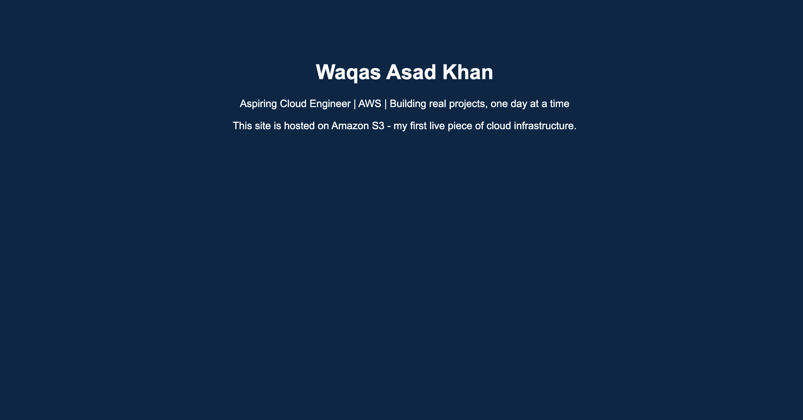
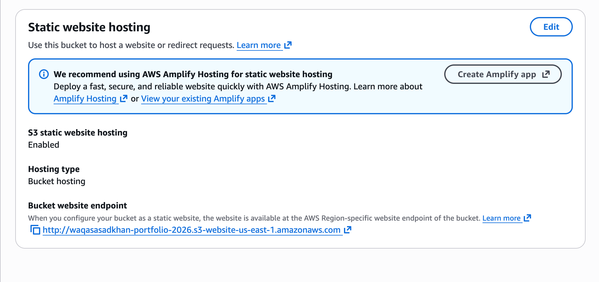
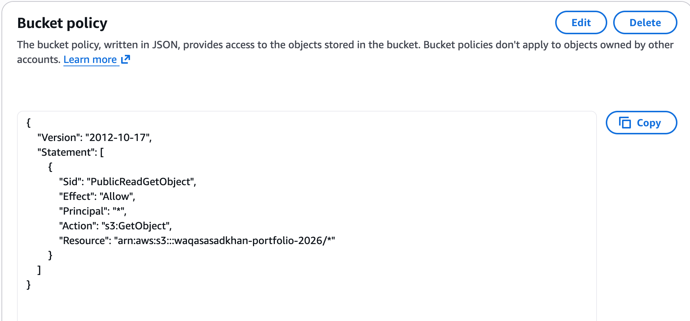

# Cloud Portfolio Website — AWS S3 Static Hosting

🔗 **Live site:** http://waqasasadkhan-portfolio-2026.s3-website-us-east-1.amazonaws.com

## Description

A personal portfolio website deployed on Amazon S3 using static website hosting. This project demonstrates core AWS fundamentals: object storage, IAM/bucket policy authoring, public access configuration, and the security trade-offs involved in hosting public content on cloud infrastructure.

## Architecture

Static HTML file → Amazon S3 bucket (static website hosting enabled) → public read access via a least-privilege bucket policy → served directly from the S3 website endpoint.

## Screenshots

**S3 Static Website Hosting Configuration**

**Bucket Policy (Least-Privilege Public Read Access)**

## What I Learned

- How S3 bucket policies work and how to scope permissions to a single action (`s3:GetObject`) rather than granting broad access
- The difference between Block Public Access settings, Object Ownership, and bucket policies, and how they interact
- How to enable and configure S3 static website hosting
- Debugging a live "Access Denied" error by reading and correcting an IAM policy
- Why HTTPS matters for production sites, and that S3 website endpoints alone only serve HTTP (solved in the next phase with CloudFront)

## Next Steps

- Add Amazon CloudFront in front of the bucket for HTTPS and CDN caching
- Lock the S3 bucket down to CloudFront-only access (Origin Access Control) instead of full public read
- Add a serverless contact form backed by Lambda, API Gateway, and DynamoDB
